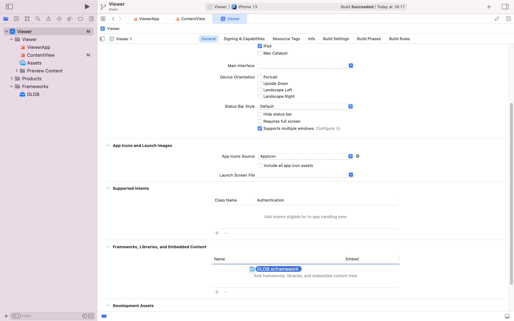

# DLDB iOS

Welcom to the DLDB SDK beta for iOS

- [Installation](#Installation)
- [Getting started](#getting-started)
- [Api and examples](#api-and-examples)
- [About DLDB](#about-dldb)
- [Support and contacts](#support-and-contacts)

## Installation

### In Swift projects

#### using CocoaPods : 
1. add `pod 'DLDB' , '0.9.8'` into your Podfile,
2. run `Pod install`
3. Add the following import directive 
``` swift
import DLDB_C
```
----
#### manual installation
1. download `DLDB.xcframework` and drag/drop the resulting folder into the `Frameworks` section of Project Explorer in Xcode


-----
### In ObjectiveC projects

#### using CocoaPods : 
1. add `pod 'DLDB' , '0.9.8'` into your Podfile,
2. run `Pod install`
3. Add the following import directive 
``` objectiveC
#import <DLDB_C/DLDB_C.h>
```

----
#### manual installation
1. download `DLDB.xcframework` and drag the resulting folder into the `Frameworks` section of Project Explorer in Xcode


## Getting started

```Swift
    // create a unique instance
    let myDLDB: DLDB_C = DLDB_C()

    // start DLDB SDK after user consent
    myDLDB.start(documentsDirectory.path, 
                dldbApiKey: "11111111-1111-1111-1111-111111111111", 
                registerCallback: nil,
                dictionary: "{\"button\" : \"t\",\"batteryLevel\" : \"i\"}")

    // once per day
    myDLDB.heartbeat();

    // on a regular basis, when app idle ?
    myDLDB.runQueriesIfAny();

    // wherever useful
    myDLDB.addEvents("{\"button\":\"log in\", \"batteryLevel\" : 55 }");
    // location and event
    CLLocation loc ...
    myDLDB.addEventsWithLocation(
        loc 
        eventsAsJson : '{"batteryLevel" : 5 }');
    // location only
    CLLocation loc ...
    myDLDB.addLocation(
        loc,
        eventsAsJson: "");

```

## Api and examples
  - [init](#init)
  - [heartbeat](#heartbeat)
  - [runQueriesIfAny](#runqueriesifany)
  - [addEvents](#addevents)
  - [queriesLog](#querieslog)
  - [locationsLog](#locationslog)
  - [close](#close)

### init

Initialize the DLDB SDK with the dldbApiKey and events dictionary.<br/>
The dldbApiKey is required and can be obtained from the  [DLDB dashboard](https://dashboard.dldb.io).<br/>

| parameter    | type     | description                               |
| -----------  |----------|------------------------------------------ |
| path         | string   | where to store local db on the device     |
| dldbApiKey   | string   | api key                                   |
| registerCallback   | nil   | ignored in beta                                   |
| dictionary  | string   | events dictionary with names and types |

The events dictionary is a json string containing one object per event. Each object defines the event name as a key and the values as the type of events : 't' for text, 'i' for numeric value.
A dictionary `{ "button" : "t", "batteryLevel": "i" }` defines 2 events : `button` with text value, and `batteryLevel` with numeric value.
The dictionary is meant to be a constant and can be changed only with new versions of your app.
The event names defined in this dictionary will the only events accepted by the function [addEvents]


*Example:*

```swift
    private let myDLDB: DLDB_C = DLDB_C()
...
    myDLDB.start(documentsDirectory.path,
                dldbApiKey: "1688e135-f5b1-4659-b84a-96ff15c07f57",
                registerCallback: nil,
                dictionary: "{\"button\" : \"t\",\"batteryLevel\" : \"i\"}")
```
---

### heartbeat

to be called on a low frequency basis compatible with the app usage frequency, in order to provide accurate estimates of query response time to the dashboard.

*Example:*

```swift
    myDLDB.heartbeat()
```

### runQueriesIfAny

to be called on a regular basis compatible with the app usage frequency, in order to provide fast query responses to the dashboard. The more often it is called the faster the queries will be replied on dashboard

*Example:*

```swift
    myDLDB.runQueriesIfAny();
```

### addEvents

2 overloads : 2 parameters CLLocation and NSString, or 6 parameters

| parameter          | type       | description                                   |
| -----------------  |------------|------------------------------------------     |
| location           | CLLocation | obtained from CLLocationManager               |
| longitudeInDegrees | double     | in decimal degrees                            |
| latitudeInDegrees  | double     | in decimal degrees                            |
| horizontalAccuracyInMeters  | double | horizontal accuracy in meters aka the radius of the area, defaults to 100m |
| epochUTCInSeconds      | Int32_t  | UTC epoch in seconds                        |
| offsetFromUTCInSeconds | Int32_t  | offset from UTC in seconds                  |
| eventsAsJson           | NSString | The name and values of the events           |

`longitudeInDegrees` and `latitudeInDegrees` indicate where the events are happening, and are taken into account if both are present and valid values.

Events `eventsAsJson` can be any metric or KPI relevant for better understanding of end-user behaviour. All events provided through this call will be attached to the same second. If you do not have access to any location information when this function is called, provide `nil` as the first parameter.
Event names must be present in the dictionary provided when calling [init](#init). Events with unknown names will be discarded.
The events will be attached to exactly the same instant, which will be either the current second provided by `epochUTCInSeconds`, or the timestamp provided by `CLLocation`

*Example:*

```swift
// location and event
    myDLDB.addEvents(0.0,
                    latitudeInDegrees: 45.0,
                    horizontalAccuracyInMeters: 25,
                    epochUTCInSeconds: 1644229847,
                    offsetFromUTCInSeconds: 3600,
                    eventsAsJson: "{\"button\":\"log in\", \"batteryLevel\" : 55 }"
                    )

// CLLocation and event
    CLLocation loc = ...
    myDLDB.addEvents(loc,
                    eventsAsJson: "{\"button\":\"log in\", \"batteryLevel\" : 55 }"
                    )

// only event
    myDLDB.addEvents(nil,
                    eventsAsJson: "{\"button\":\"log in\", \"batteryLevel\" : 55 }"
                    )

```

### queriesLog

| parameter    | type     | description                                   |
| -----------  |----------|------------------------------------------     |
| maxEntries   | number   | the max number of entries to include in the log |

return the log of `maxEntries` most recent queries ran on the device.

The log is a json array (most recent last) of json objects, each object representing a query ran on the device

| Property  | Description   |
| --------  | ------------- |
| id        | uuid of query  |
| type      | type of query  |
| fetched   | timestamp in ms when the query was fetched from server |
| answered  | timestamp in ms when the query was answered on the device  |
| finished  | timestamp in ms when the query was finished on the device |
| tries     | number of tries to run the query |
| json_in   | parameters of the query |
| json_out  | results of the query |

*Example:*

```swift
        let latestQueriesLog = myDLDB.queriesLog(5)
        print(latestQueriesLog ?? "")
```

### locationsLog

| parameter    | type     | description                                   |
| -----------  |----------|------------------------------------------     |
| durationInSeconds | number   | how far back in the past to look for locations |
| maxEntries   | number   | the max number of entries to include in the log |
| resolution   | number   | resolution of returned locations |

return the log of at most `maxEntries` most recent unique locations stored on the device during the last `durationInSeconds`.

The log is a json array (most recent last) of [h3](https://h3geo.org) in hex string format, at resolution `resolution`.
A call to this function generates an entry into the queries log.

*Example:*

```swift
        let latestLocationsLog = myDLDB.locationsLog(3600*24, maxEntries: 100, resolution: 7)
        print(latestLocationsLog ?? "")
```

### close

to be called when shutting down the app.

*Example:*

```swift
        myDLDB.close()  
```

## About DLDB

DLDB provides behavioural analytics for mobile applications with privacy by design.

DLDB architecture relies on an SDK to be integrated into your mobile application, and a dashboard https://dashboard.dldb.io/ to build, query, analyze the behaviour of your application users.

For your application, DLDB deploys a distributed database, where each database instance is inside the mobile application scope. All the analytics queries are run by the devices and no raw data ever leaves the devices. Only the statistical KPI-s are sent anonymously to the DLDB dashboard .

From the DLDB dashboard, developers, analysts and app owners can build their own queries and analyze the results. No need to have any additional storage or analytics platform: DLDB provides an end-to-end solution.

DLDB SDK is written in C and has bindings to most common languages - works natively on iOS, Android, React-Native and Flutter. We also have Python binding and C libraries for IoT devices.

### Highlights

- Seamless integration of DLDB SDK into your mobile app source base, in many flavours, on all major platforms
- Define your own schema of collected events and values
- Built-in GDPR compliance on the right to be forgottent: all data belonging to your user stays on the device, so delete the data whenever requested
- Built-in GDPR compliance on the traceability of data usage: all requests processed by the DLDB SDK are traced and can be shown on demand
- No additional online storage
- Rapid scaling

## Support and contacts

If you face any problems or have any questions, please contact us

support channel in Discord: https://discord.gg/TD4f6p6nUH

email: support@dldb.io 

web: https://dldb.io/

subscribe for product updates and news: https://dldb.io/#Beta
