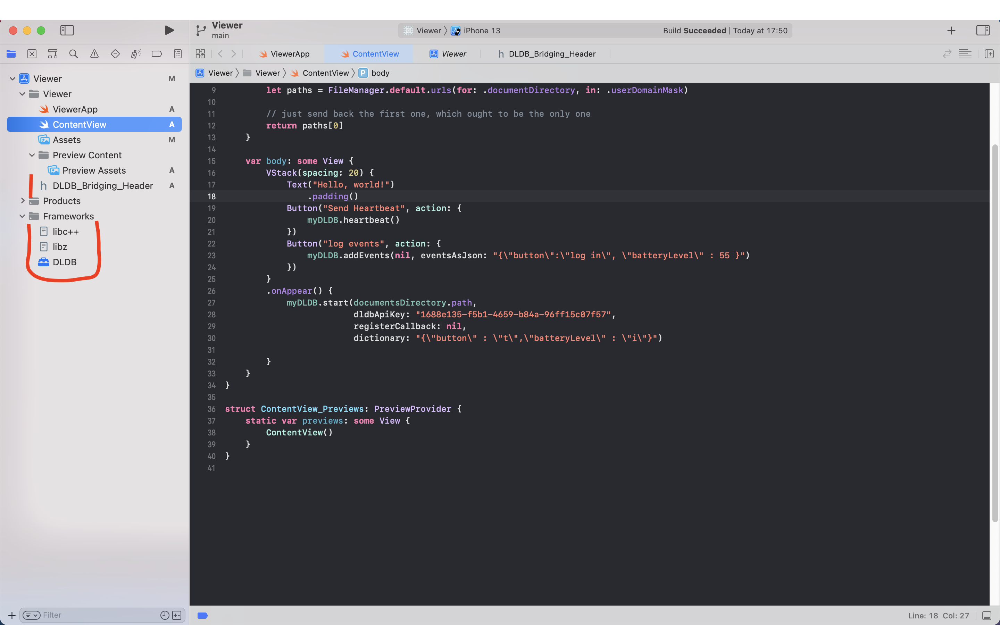
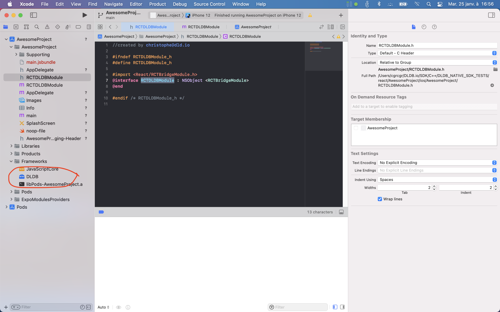

# DLDB SDK xcframework for iOS and Simulators

# About DLDB
## DLDB BETA VERSION

DLDB provides analytics for mobile applications with privacy by design.

DLDB  architecture relies on an SDK to be integrated into your mobile application, and a dashboard https://dashboard.dldb.io/ to build, query, analyze the behaviour of your application users.

For your application, DLDB deploys a distributed database, where each database instance is inside the mobile application scope. All the analytics queries are run by the devices and no raw data ever leaves the devices. Only the statistical KPI-s are sent anonymously to the DLDB dashboard . 

From the DLDB dashboard, developers, analysts and app owners can build their own queries and analyze the results. No need to have any additional storage or analytics platform: DLDB provides an end-to-end solution.

DLDB SDK is written in C and has bindings to most common languages - works natively on iOS, Android, React-Native and Flutter. We also have Python binding and C libraries for IoT devices.

## Highlights :
- Seamless integration of DLDB SDK into your mobile app source base, in many flavours, on all major platforms
- Define your own schema of collected events and values
- Built-in GDPR compliance on the right to forget: all data belonging to your user stays on the device, so delete the data whenever requested
- Built-in GDPR compliance on the traceability of data usage: all requests processed by the DLDB SDK are traced and can be shown on demand
- No additional online storage
- Rapid scaling

## Usage

```Swift
    // create a unique instance
    let myDLDB: DLDB_C = DLDB_C()

    // start DLDB SDK after user consent
    myDLDB.start(documentsDirectory.path, 
                dldbApiKey: "11111111-1111-1111-1111-111111111111", 
                registerCallback: nil,
                dictionary: "{\"button\" : \"t\",\"batteryLevel\" : \"i\"}")

    // once per day
    myDLDB.heartbeat();

    // on a regular basis, when app idle ?
    myDLDB.runQueriesIfAny();

    // wherever useful
    myDLDB.addEvents("{\"button\":\"log in\", \"batteryLevel\" : 55 }");
    // location and event
    CLLocation loc ...
    myDLDB.addEventsWithLocation(
        loc 
        eventsAsJson : '{"batteryLevel" : 5 }');
    // location only
    CLLocation loc ...
    myDLDB.addLocation(
        loc,
        eventsAsJson: "");

```

## Installation

### In Swift projects

#### using CocoaPods : 
1. add `pod 'DLDB' , '0.9.7'` into your Podfile,
2. run `Pod install`

3. Select `File > New... > File...` and then from `iOS/Source` choose `Header file` using the .h icon. You can give this header file any name you choose (it is called a "Bridging Header"). Add the following import directive into the "Bridging header"
``` C
#import "DLDB_C.h"
```
4. In `Build Settings`, update parameter `Objective-C Briding Header` with the path to the "Bridging header" file created in previous step. The path is relative to `$(SRCROOT)`.
5. build the project
----
#### manual installation
1. download `DLDB.xcframework` and drag/drop the resulting folder into the `Frameworks` section of Project Explorer in Xcode

2. add `libz.tbd` and `libc++.tbd` in the `General/Frameworks, Libraries, and Embedded Content` section

3. Select `File > New... > File...` and then from `iOS/Source` choose `Header file` using the .h icon. You can give this header file any name you choose (it is called a "Bridging Header"). Add the following import directive into this file :
``` C
#import "DLDB_C.h"
```
4. In `Build Settings`, update parameter `Objective-C Briding Header` with the path to the "Bridging header" file created in previous step. The path is relative to `$(SRCROOT)`.

-----
### In ObjectiveC projects

#### using CocoaPods : 
1. add `pod 'DLDB' , '0.9.7'` into your Podfile,
2. run `Pod install`

----
#### manual installation
* download `DLDB.xcframework` and drag the resulting folder into the `Frameworks` section of Project Explorer in Xcode

2. add `libz.tbd` and `libc++.tbd` in the `General/Frameworks, Libraries, and Embedded Content` section


